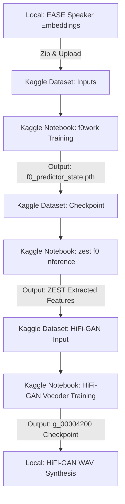

# Zero-Shot Emotion Transfer Replication (ZEST)

This document describes the step-by-step pipeline executed to replicate the zero-shot emotion transfer results of the ZEST model on the Emotional Speech Database (ESD).

---

## Reconstruction Pipeline Overview



---

## Steps executed in Order

### Phase 1: Local EASE Embeddings Extraction
1. **Extract Speaker Embeddings**:
   Run `code/EASE/get_speaker_embedding.py` to extract 512-dimensional vector embeddings of the source/target speakers:
   ```powershell
   venv/Scripts/python.exe EASE/get_speaker_embedding.py
   ```
2. **Train Speaker Classifier**:
   Verify speaker classification groupings locally by running `code/EASE/speaker_classifier.py`:
   ```powershell
   venv/Scripts/python.exe EASE/speaker_classifier.py
   ```
3. **Zip & Upload Features**:
   Zip the local features directory (containing speaker and style embeddings) and upload it to Kaggle to prepare the training datasets.

---

### Phase 2: Pitch Predictor Model Training (`f0work`)
1. **Kaggle Setup**:
   Created a Kaggle dataset containing the raw audio files, manifest configs, and speaker embeddings.
2. **Model Training**:
   Run the pitch predictor training loop (`f0work` Kaggle notebook) utilizing PyTorch with CUDA support.
3. **Export Checkpoint**:
   Once training finalized, download the generated pitch predictor weights file:
   - **`f0_predictor_state.pth`**
   - **`esd_f0_stats.pth`**

---

### Phase 3: Zero-Shot Pitch Conversion Inference
1. **Kaggle Dataset**:
   Upload the trained `f0_predictor_state.pth` weight file to Kaggle as a new input dataset.
2. **Run ZEST F0 Inference Notebook**:
   Feed `f0_predictor_state.pth` into the `zest f0 inference` Kaggle notebook.
3. **Convert Pitch Contours**:
   The notebook runs the pitch predictor in inference mode to map target speaker emotions onto the source speech contours.
4. **Export ZEST Extracted Features**:
   Download the output directory containing the style embeddings and converted pitch contours (`pred_DSDT_f0/`).

---

### Phase 4: HiFi-GAN Vocoder Training
1. **Prepare Vocoder Dataset**:
   Zip the ZEST-extracted features (Wav2Vec style embeddings and converted pitch contours) and upload them as a Kaggle dataset.
2. **Train Vocoder Model**:
   Run vocoder training for 9 epochs (4,200 steps) on Kaggle GPUs to learn to map style embeddings and pitch contours back into synthesized speech waveforms.
3. **Download Vocoder Checkpoints**:
   Download the trained vocoder files:
   - **`g_00004200`** (checkpoint weight)
   - **`config.json`** (vocoder config)
   And place them locally inside `code/HiFi-GAN/checkpoints/ESD/`.

---

### Phase 5: Local Speech Synthesis (Inference)
1. **Update Local Imports & Librosa Compatibility**:
   - Modified local `dataset.py` to use keyword arguments for `librosa.filters.mel` to prevent TypeErrors in Librosa 0.10+.
   - Downgraded virtual env `setuptools` to version `69.5.1` (using `setuptools<70` constraint) to ensure the legacy `pkg_resources` API imported by `librosa` is present.
   - Updated `dataset.py` to use `os.path.join` rather than string concatenation when loading inputs.
2. **Run Audio Synthesis**:
   Synthesize the final converted waveforms using the trained vocoder on the local CPU:
   ```powershell
   ..\venv\Scripts\python.exe inference.py --checkpoint_file checkpoints/ESD/g_00004200 --pitch_folder ../F0_predictor/f0_contours --emo_folder ../F0_predictor/wav2vec_feats --convert --debug
   ```

* All synthesized WAV outputs will be generated in `code/HiFi-GAN/DSDT/`.
